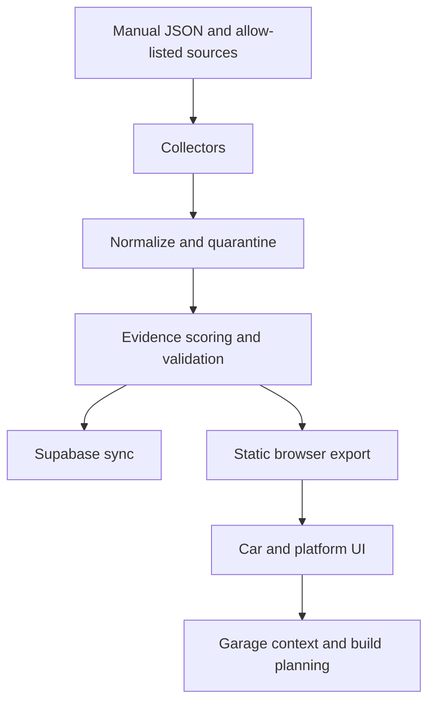

# ModPicker project guide

ModPicker helps someone choose automotive parts for a specific car or an engine/platform family, understand the evidence behind each result, compare current seller observations, and turn a shortlist into a practical build sheet. The product is expanding into a complete virtual-garage workspace where the selected vehicle's actual condition, modifications, maintenance state and owner preferences can shape recommendations.

This document is the durable product brief. The expanded feature sequence lives in [ROADMAP.md](ROADMAP.md), the implementation review and dated changes live in [REVIEW_AND_PLAN.md](REVIEW_AND_PLAN.md), the operational runbook lives in [OPERATIONS.md](OPERATIONS.md), and the complete catalog contribution procedure lives in [MANUAL_CATALOG.md](MANUAL_CATALOG.md).

## Product goals

1. **Correct scope.** A car flow starts with Make → Model → Year → Variant. An engine/platform flow starts with Make → Engine/platform → Application. A platform association broadens discovery but never silently changes exact fitment.
2. **Evidence before scores.** Ratings are calculated only from identified products with current, published review evidence. Missing evidence is shown as “Not rated”; it is never replaced with a guessed zero or a synthetic score.
3. **Useful uncertainty.** Exact source-listed fitment, platform-related results, unknown prices, stale observations, pending evidence and future interchange claims have visibly different states.
4. **A low-friction build sheet.** A user can add parts, set quantities, choose a seller, record notes and purchase status, see known versus unknown cost, undo a destructive edit, and export or share the sheet.
5. **Vehicle-specific ownership context.** A garage profile can record the user's actual car, modifications, history, current problems, preferences, goals, maintenance state and diagnostic history so future planning is based on the real vehicle rather than a stock application alone.
6. **Deterministic growth.** Scheduled updates, manual JSON contributions, and future source adapters use documented validation and provenance rules. No ChatGPT or other language model is required to add catalog records or calculate scores.
7. **Reviewable operations.** Every automated refresh produces a status record, a review queue, canonical JSON, a browser fallback bundle, and a diff that can be inspected before release.

## User flows

### Find parts for a car

Choose a make, model, year, and variant. The catalog then uses the selected vehicle ID to show only parts linked to that exact application. The application selector is intentionally separate from the goal selector so a goal such as Reliability changes ordering without changing fitment.

### Find parts for an engine or platform

Switch to **Engine / platform**, choose a make and family such as **BMW M52TU**, then choose a listed application when one is needed. Results are limited by the platform’s explicit vehicle IDs and category allow-list. Cards identify platform-related results and continue to show whether the selected application has exact source-listed fitment.

### Build and verify

Add parts from either scope, open Details for source links and fitment evidence, and use the Build Sheet to set quantity, seller, notes, purchase state, budget, and labor assumptions. Prices are dated observations, not checkout promises. Unknown values stay unknown until a source supplies them.

### Maintain a virtual garage

Open **Garage** for the selected vehicle. The first implementation stores a browser-local profile with photos, odometer, condition, current modifications, vehicle/build history, known problems, likes/dislikes, build goals, maintenance records, diagnostic-code history and receipt metadata. It also exposes a structured recommendation context that later deterministic/AI planners can consume. Vehicle-specific service intervals, fluids and capacities remain blank until a source supports them.

## Data and pipeline contract



- `data/manual/vehicles.json` contains exact curated applications.
- `config/platforms.json` and `data/manual/platforms.json` contain engine/chassis families, aliases, exact application IDs, and category allow-lists.
- `data/manual/parts.json` is reserved for manually reviewed product records.
- `config/catalog_sources.json`, `config/product_pages.json`, and `config/product_domains.json` define automated discovery and scraping boundaries.
- `data/live/` is generated pipeline output. `pipeline-data.js` is the committed browser fallback generated from that output.
- The browser adapter in `pipeline-bridge.js` is the only place that converts pipeline records into UI records. The Supabase adapter uses the same shape.
- Browser-local ownership profiles currently use `modpicker-owner-garage-v1`; this is prototype storage, not the long-term account/media schema.

## Accuracy rules

- A model-year discovery result does not create engine, trim, or part fitment.
- Platform membership does not create exact fitment.
- A reviewed fitment rule is re-evaluated against every exact application on every refresh. Shared-platform parts therefore follow newly imported years automatically when the new application carries the same family/engine/body/transmission attributes; generated fitment arrays are never hand-maintained.
- Cross-make/model interchange will be modeled separately from ordinary fitment. Shared part numbers, donor applications or community examples may broaden discovery but must not silently create exact fitment.
- A product rating requires exact product identity, a current aggregate rating, a reported review count, source URL, and retrieval date.
- Prices must be direct USD observations tied to an identified product. Search pages and unmatched marketplace results are excluded.
- Safety-critical specifications, maintenance fluids/capacities, torque values and installation procedures need a primary manual or manufacturer source when available.
- Collector failures are reported in status and do not erase a previously known observation or bypass an allow-list.
- AI summaries and recommendations may explain structured evidence but do not replace the underlying source requirements.

## Active improvement roadmap

### Completed in the current release

- Replaced the single long vehicle list with hierarchical car selectors and a dedicated platform mode.
- Added platform records for BMW M52TU, Mazda BP-4W, and Subaru FA20 with scoped applications.
- Added manual catalog validation and documented automated/manual contribution paths.
- Kept evidence-backed scoring and explicit unrated states throughout car and platform views.
- Added browser coverage for multi-level selection, platform scope, build persistence, sharing, details, routes, and mobile layout.
- Added evidence-backed multi-year Z3 rules, including engine/transmission constraints and automatic expansion for future imported applications.

### In implementation now

1. Garage profile per exact selected vehicle: photos, current modifications, history, condition/problems, likes/dislikes, build goals and preference weights.
2. Maintenance workspace: mileage/date intervals, fluid/spec/capacity fields, common-service starter list, code history, receipt metadata and copyable maintenance report.
3. Structured recommendation-context output so the future planner can consume vehicle state and owner preferences without parsing free-form UI state.
4. UI simplification around the highest-value jobs: Garage, find parts, build planning and maintenance.

### Next priorities

1. Add a reviewed interchange-group schema and pilot it on a small set of documented shared components across different applications.
2. Add sourced maintenance specifications for the deep vehicle families before automatically populating intervals, fluids or capacities.
3. Expand exact vehicle applications only when a primary or clearly identified source supports them.
4. Add more permitted structured product feeds and exact fitment mappings before adding more platform families.
5. Add goal-driven build planning with prerequisite/conflict constraints and evidence-backed performance ranges.
6. Add normalized community/forum evidence and cached consensus summaries with links to the underlying discussions.
7. Add a maintainer review-queue view for ambiguous candidates and community submissions.
8. Add used-listing adapters, beginning with permitted APIs/feeds rather than unsupported private scraping.
9. Add account-backed garage/media synchronization only after browser export/import behavior and privacy expectations are documented.
10. Add local-shop/community/social and vehicle-visualizer features after location privacy, moderation and media storage are ready.

The complete sequence and scope boundaries are maintained in [ROADMAP.md](ROADMAP.md). Each completed priority should update this document, `REVIEW_AND_PLAN.md`, the relevant tests, and the operational runbook in the same change.

## Quality gates

Run these before publishing a catalog change:

```bash
python scripts/validate_catalog.py
python -m unittest discover -s tests -v
python -m pipeline.run
python -m pipeline.validate
```

For UI changes, also run the browser smoke test described in `tests/browser-smoke.cjs` and inspect the mobile screenshot. GitHub Actions repeats the manual validation, unit tests, collection, publication gate, Supabase sync, and static-data commit.

## Official configuration import

See [DATA_IMPORTS.md](DATA_IMPORTS.md) for the EPA database import, source manifest, constrained compatibility rules, manual additions and remaining accuracy gates.
